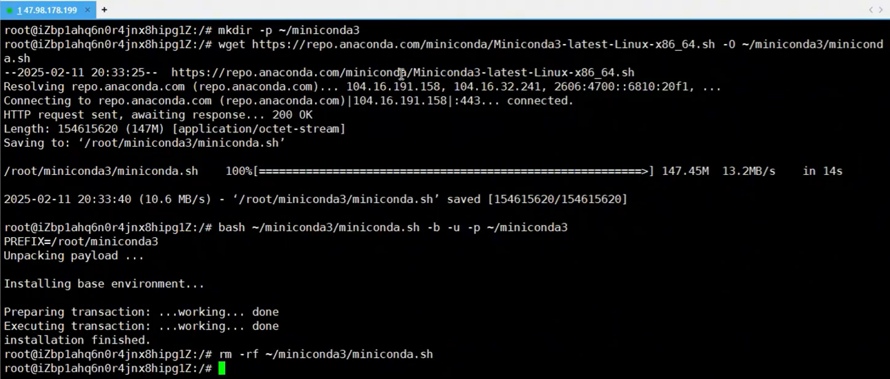
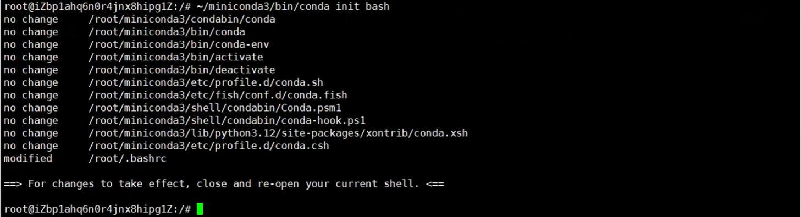
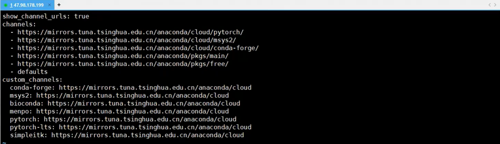

# langchain开发环境准备

## 1.Miniconda简介

Miniconda是一个更小的Anaconda发行版（Anaconda是一个包含大量预装数据科学和机器学习库的Python发行版），它只包含conda包管理器和Python以及其必要的库。Miniconda的目的是提供一个更轻量级的选项来安装和运行conda环境，同时保持Anaconda的核心功能。Miniconda可以安装在任何操作系统上，并且可以用于创建轻量级的Python环境，适合那些需要定制环境，不需要Anaconda完整发行版中所有组件的用户。使用Miniconda，用户可以轻松地安装、更新和管理Python包，以及创建隔离的Python环境。

## 2.开发环境

### 2.1 环境设置

#### 2.1.1 install miniconda

[Installing Miniconda - Anaconda](https://www.anaconda.com/docs/getting-started/miniconda/install#macos-linux-installation)

```bash
mkdir ~/miniconda3
wget https://repo.anaconda.com/miniconda/Miniconda3-latest-Linux-x86_64.sh -O ~/miniconda3/miniconda.sh
bash ~/miniconda3/miniconda.sh -b -u -p ~/miniconda3
```



#### 2.1.1 激活miniconda

```bash
~/miniconda3/bin/conda init bash
source ~/.bashrc
```



#### 2.1.2 修改镜像源

```bash
vim ~/miniconda3/.condarc
```



```bash
show_channel_urls: true
channels:
  - https://mirrors.tuna.tsinghua.edu.cn/anaconda/cloud/pytorch
  - https://mirrors.tuna.tsinghua.edu.cn/anaconda/cloud/msys2
  - https://mirrors.tuna.tsinghua.edu.cn/anaconda/cloud/conda-forge
  - https://mirrors.tuna.tsinghua.edu.cn/anaconda/pkgs/main
  - https://mirrors.tuna.tsinghua.edu.cn/anaconda/pkgs/free
custom_channels:
  conda-forge: https://mirrors.tuna.tsinghua.edu.cn/anaconda/cloud
  msys2: https://mirrors.tuna.tsinghua.edu.cn/anaconda/cloud
  bioconda: https://mirrors.tuna.tsinghua.edu.cn/anaconda/cloud
  menpo: https://mirrors.tuna.tsinghua.edu.cn/anaconda/cloud
  pytorch: https://mirrors.tuna.tsinghua.edu.cn/anaconda/cloud
  pytorch-lts: https://mirrors.tuna.tsinghua.edu.cn/anaconda/cloud
  simpleitk: https://mirrors.tuna.tsinghua.edu.cn/anaconda/cloud
```

#### 2.1.3 创建python基于conda的虚拟环境

- **最低要求**：**Python >= 3.10**（官方明确说明）。
- **最佳实践**：使用 **Python 3.10 或 3.11**，并在**虚拟环境**中安装 LangChain，这样可以获得最好的性能、特性和兼容性。

主仓库地址：https://github.com/langchain-ai/langchain,  关键文件是 `pyproject.toml`。在这个文件中，你可以找到 `project.requires-python` 字段，它明确规定了兼容的 Python 版本。

```bash
conda create --name first-agent-python3.10.2 python==3.10.2 -y
conda env list
conda activate first-agent-python3.10.2
```

## 3. **GPT-3时代下第一代大模型开发工具**

  `LangChain`可以称之为自`2022年底`大模型技术爆火以来的第一个真正意义上的大模型开发框架。大模型本质上无法直接解决实际的问题，仅仅是一个能够分析、推理和生成文本的黑盒。直到现在，所有的开发者们仍然在不断探索如何把大模型的强大能力与实际应用场景结合起来，而当时`LangChain`的出现，直接让大模型开发变得简单起来，它将大模型开发过程中常用的功能、工具、流程等等全部封装成一个个的组件，使开发者可以像搭乐高积木一样，快速的组合出适用于不同场景需求的大模型应用。

​        `LangChain`的首个版本于`2022年10月`开源，直到现在仍然在以一个飞快的速度不断进行迭代升级。从一个开源 `Python/TS` 框架逐渐发展，形成包括“链”和“代理”等核心组件，现在已走向企业级阶段，发展成了`LangChain AI`，其拥有目前`Agent`技术领域最大的开源生态，衍生出了多个开源项目框架，各自都在大模型的技术领域承担着不同的开发任务角色。

​        从一个形象的角度来说，LangChain的功能定位其实并不是我们现在所谓的Agent开发框架，而是一个大模型功能增强器，借助LangChain，哪怕在GPT-3模型时代，也能让模型完成对话、拥有记忆、甚至是完成结构化输出等功能。

> LangChain官网：https://www.langchain.com/

### 3.1 **备受争议的工具功能**

​        虽说LangChain的开源，在短时间内收获了大量的开发者用户，这也一度使得LangChain在2023年成为最受欢迎的大模型开发工具没有之一。但每项技术都会受限于其诞生的时代背景，LangChain也不例外。在GPT-3时代，大模型以补全模型为主，只能以类似“成语接龙”的方式对文本进行补全，并且实际运行效果也非常不稳定。此时LangChain借助一些高层封装的API，能够让模型完成对话、调用外部工具、甚至是结构化输出等功能，这在当时是非常大的进步，也为开发者提供了极大的便利。

​        但是，伴随着GPT-3.5模型的发布，对话模型正式登上历史的舞台，并逐渐成为主流。而得益于对话模型更强的指令跟随能力，很多GPT-3需要借助LangChain才能完成的工作，已经成为GPT-3.5原生自带的一些功能。而等到GPT-4逐渐普及，包括调用外部工具（Function calling）、结构化输出、系统提示词等功能，都成了模型的基础功能。而对于开发者而言，此时再使用LangChain再对这些功能进行封装就显得多此一举。

举个例子，为了更好的兼容不同模型的调用，谷歌ADK采用了LiteLlm作为底层模型调度框架，一个库即可调用各类模型，而LangChain则为每个主流模型单独封装了一个库，调用不同模型的时候需要导入不同模型对应的库，例如调用DeepSeek就需要安装`langchain-deepseek`，而调用Gemini则需要安装`langchain-google-genai`。

### 3.2 更加适用于当前Agent开发的LangChain工具生态

​        在经历了短暂的阵痛后，LangChain果断进行了大刀阔斧的改革。LangChain调整的思路非常简单：

### 3.3 安装langchain

为了保证该langchain系列的文章能够在任何环境都可以运行，我们需要记录当前安装的任何依赖库的版本信息。

```bash
pip index versions langchain #查询当前有哪些版本可以使用
pip install langchain==1.0.3 #安装特定的版本
```
