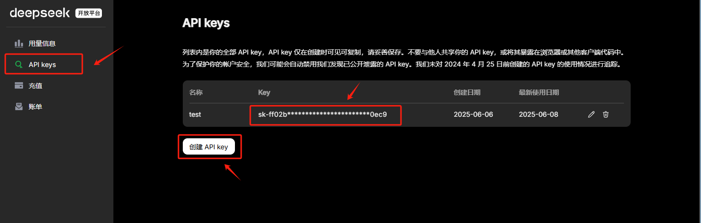
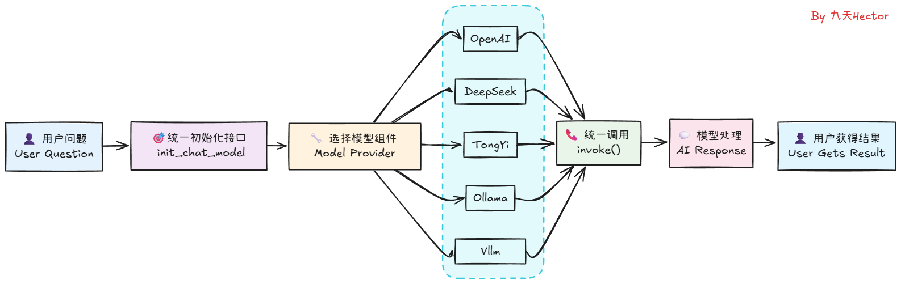
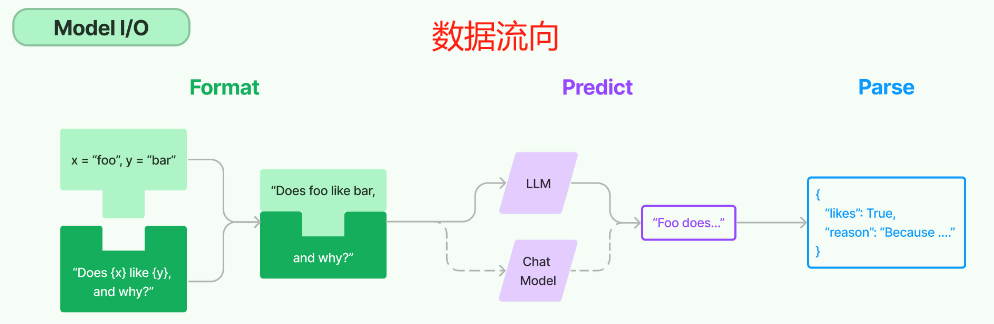

# langchain快速入门与底层原理

## 1.**尝试调用DeepSeek**

  在进行`LangChain`开发之前，首先需要准备一个可以进行调用的大模型，这里我们选择使用`DeepSeek`的大模型，并使用`DeepSeek`官方的`API_KEK`进行调用。如果初次使用，需要现在`DeepSeek`官网上进行注册并创建一个新的`API_Key`，其官方地址为：https://platform.deepseek.com/usage



注册好`DeepSeek`的`API_KEY`后，首先在项目同级目录下创建一个`.env`文件，用于存储`DeepSeek`的`API_KEY`，如下所示：

```
DEEPSEEK_API_KEY=<YOUR-API-KEY>
```

接下来通过`python-dotenv`库读取`.env`文件中的`API_KEY`，使其加载到当前的运行环境中，那么需要安装依赖库:

```bash
pip index versions python-dotenv #查询当前有哪些版本可以使用
pip install python-dotenv==1.2.1 #安装特定版本
```

代码如下：

```python
import os
from dotenv import load_dotenv 
load_dotenv(override=True)

deepSeek_api_key = os.getenv("DEEPSEEK_API_KEY")
print(deepSeek_api_key)  # 可以通过打印查看
```

我们在当前的运行环境下不使用`LangChain`，直接使用`DeepSeek`的`API`进行网络连通性测试，测试代码如下：

```
pip index versions openai #查询当前有哪些版本可以使用
pip install openai==2.6.1 #安装特定版本
```

如果可以正常收到`DeepSeek`模型的响应，则说明`DeepSeek`的`API`已经可以正常使用且网络连通性正常。

```python
import os
from openai import OpenAI
from dotenv import load_dotenv 
load_dotenv(override=True)
deepseek_api_key = os.getenv("DEEPSEEK_API_KEY")

client = OpenAI(
    api_key=deepseek_api_key,
    base_url="https://api.deepseek.com")

response = client.chat.completions.create(
    model="deepseek-chat",
    messages=[
        {"role": "system", "content": "You are a helpful assistant"},
        {"role": "user", "content": "Hello"},
    ],
    stream=False
)

print(response.choices[0].message.content)
```

## 2.DeepSeek接入LangChain流程

  接下来我们要考虑的是，对于这样一个`DeepSeek`官方的`API`，如何接入到`LangChain`中呢？其实非常简单，我们只需要使用`LangChain`中的一个`DeepSeek`组件即可向像述代码一样，直接使用相同的`DeepSeek API KEY`与大模型进行交互。因此，我们首先需要安装`LangChain`的`DeepSeek`组件，安装命令如下：

```bash
pip index versions langchain-deepseek #查询当前有哪些版本可以使用
pip install langchain-deepseek==1.0.0 #安装特定版本
```

```python
import os
from openai import OpenAI
from dotenv import load_dotenv 
from langchain.chat_models import init_chat_model

load_dotenv(override=True)

model = init_chat_model(model="deepseek-chat", model_provider="deepseek")
question = "你好，请你介绍一下你自己。"
result = model.invoke(question)
print(result.content)

```

这里可以看到，仅仅通过两行代码，我们便可以在`LangChain`中顺利调用`DeepSeek`模型，并得到模型的响应结果。相较于使用`DeepSeek`的`API`，使用`LangChain`调用模型无疑是更加简单的。同时，不仅仅是`DeepSeek`模型，`LangChain`还支持其他很多大模型，如`OpenAI`、`Qwen`、`Gemini`等，我们只需要在`init_chat_model`函数中指定不同的模型名称，就可以调用不同的模型。其工作的原理是这样的：



理解了这个基本原理，如果大家想在用`LangChain`进行开发时使用其他大模型如`Qwen3`系列，则只需要先获取到`Qwen3`模型的`API_KEY`，然后安装`Tongyi Qwen`的第三方依赖包，即可同样通过`init_chat_model`函数来初始化模型，并调用`invoke`方法来得到模型的响应结果。关于`LangChain`都支持哪些大模型以及每个模型对应的是哪个第三方依赖包，大家可以在`LangChain`的官方文档中找到，访问链接为：[https://docs.langchain.com/oss/python/integrations/chat](https://docs.langchain.com/oss/python/integrations/chat)

当然，除了在线大模型的接入，`langChain`也支持使用`Ollama`、`vLLM`等框架启动的本地大模型。

## 3. LangChian核心功能：链式调用实现方法

顾名思义，`LangChain`之所以被称为`LangChain`，其核心概念就是`Chain`。 `Chain`翻译成中文就是“链”。一个链，指的是可以按照某一种逻辑，按顺序组合成一个流水线的方式。比如我们刚刚实现的问答流程： 用户输入一个问题 --> 发送给大模型 --> 大模型进行推理 --> 将推理结果返回给用户。这个流程就是一个链。

### 3.1 尝试搭建一个简单的链

例如，我们这里可以先尝试着搭建一个简单的链，将模型输出结果“过滤”为一个纯字符串格式：

```python
import os
from openai import OpenAI
from dotenv import load_dotenv 
from langchain.chat_models import init_chat_model
from langchain_core.output_parsers import StrOutputParser

load_dotenv(override=True)

model = init_chat_model(model="deepseek-chat", model_provider="deepseek")
basic_qa_chain = model | StrOutputParser()
question = "你好，请你介绍一下你自己。"
result = basic_qa_chain.invoke(question)
print(result)
```

此时result就不再是包含各种模型调用信息的结果，而是纯粹的模型响应的字符串结果。而这里用到的StrOutputParser()实际上就是用于构成LangChain中一个链条的一个对象，其核心功能是用于处理模型输出结果。同时我们也能发现，只需要使用`Model | OutputParser`，即可高效搭建一个链。

### 3.2 加入提示词模板创建链

  接下来我们尝试为当前的执行流程添加一个提示词模板，我们可以借助ChatPromptTemplate非常便捷的将一个提示词模板，同样以链的形式加入到当前任务中：

```python
from dotenv import load_dotenv 
from langchain.chat_models import init_chat_model
from langchain_core.output_parsers import StrOutputParser
from langchain_core.prompts import ChatPromptTemplate

load_dotenv(override=True)

prompt_template = ChatPromptTemplate([
    ("system", "你是一个乐意助人的助手，请根据用户的问题给出回答"),
    ("user", "这是用户的问题： {topic}， 请用 yes 或 no 来回答")
])

model = init_chat_model(model="deepseek-chat", model_provider="deepseek")
bool_qa_chain = prompt_template | model | StrOutputParser()

question = "请问 1 + 1 是否 大于 2？"
result = bool_qa_chain.invoke(question)
print(result)
```

一个最基本的`Chain`结构，是由`Model`和`OutputParser`两个组件构成的，其中`Model`是用来调用大模型的，`OutputParser`是用来解析大模型的响应结果的。所以一个最简单的`LLMChain`结构，其数据流向正如下图所示：



当我们调用指令跟随能力较强的大模型的时候，借助提示词模板即可实现结构化输出的结果。

### 3.3 借助提示词模板和结果解析器实现功能更加复杂的链

至此，我们就搭建了一个非常基础的链。在LangChain中，一个基础的链主要由三部分构成，分别是提示词模板、大模型和结果解析器： 用户输入 → PromptTemplate → ChatModel → OutputParser → 结果。
