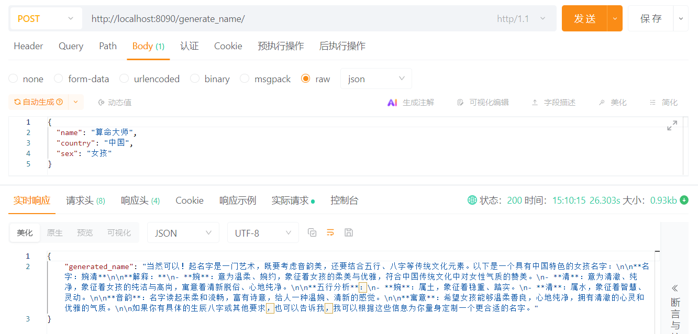
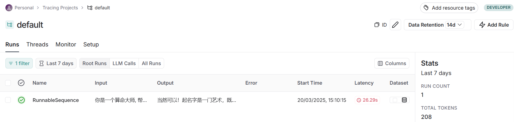

# langchain服务部署与链路监控

## 1. 设置开发环境

在 Linux上：打开终端, 编辑你的 shell 配置文件（例如 `~/.bashrc`）, 在文件末尾添加以下行：保存文件并退出编辑器。

```
export LANGSMITH_TRACING=true
export LANGSMITH_API_KEY="<your-langsmith-api-key>"
export LANGCHAIN_ENDPOINT="https://api.smith.langchain.com"
# The example uses OpenAI, but it's not necessary if your code uses another LLM provider
export OPENAI_API_KEY="<your-openai-api-key>"
```

 运行以下命令使更改生效：

```
source ~/.bashrc
```

创建一个LangChain项目:

```bash
langchain app new langchain_deployment_trace
```

使用poetry添加第三方包(例如langchain-openai等)

```
pip index versions pipx
pip install pipx==1.7.1
pipx ensurepath

pip index versions poetry
pipx install poetry==2.1.1
```

添加依赖：

```bash
poetry add langchain==0.3.20
poetry add langchain-community==0.3.19
poetry add langchain-openai==0.3.8
poetry add langsmith==0.3.15
```

## 2. 主要内容

### 2.1 LangServe服务部署

```bash
poetry run langchain serve --port 8090 
```

启动之后我们将会看到：


然后我们使用Postman进行测试：



### 2.2 LangSmith Tracing 跟踪

最后我们在langsmith上查看链路监控:



### 2.3 Verbose & Debug 详细日志打印

在 Linux上：打开终端, 编辑你的 shell 配置文件（例如 `~/.bashrc`）, 在文件末尾添加以下行：保存文件并退出编辑器。

```bash
export TAVILY_API_KEY="<your-tavily-api-key>"
```

运行以下命令使更改生效：

```bash
source ~/.bashrc
```

参考debug_verbose的代码。

## **3. 参考：**

1. LangSmith官网： [https://smith.langchain.com]( https://smith.langchain.com)
2. tavily官网: [https://tavily.com](https://tavily.com)

