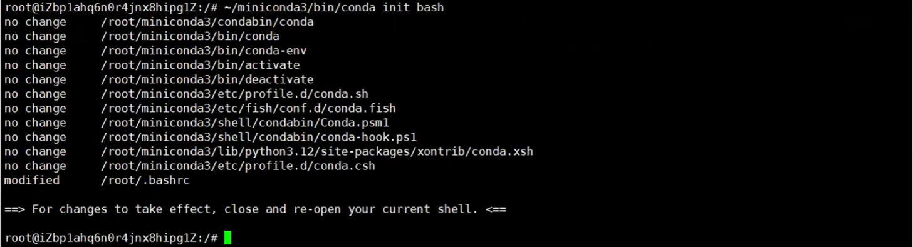
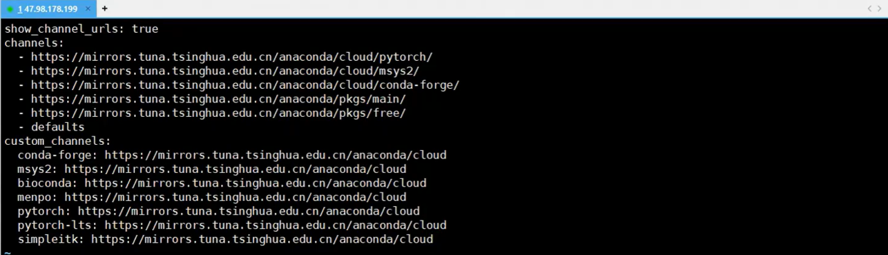

# langgraph开发环境准备

## 1.Miniconda简介

Miniconda是一个更小的Anaconda发行版（Anaconda是一个包含大量预装数据科学和机器学习库的Python发行版），它只包含conda包管理器和Python以及其必要的库。Miniconda的目的是提供一个更轻量级的选项来安装和运行conda环境，同时保持Anaconda的核心功能。Miniconda可以安装在任何操作系统上，并且可以用于创建轻量级的Python环境，适合那些需要定制环境，不需要Anaconda完整发行版中所有组件的用户。使用Miniconda，用户可以轻松地安装、更新和管理Python包，以及创建隔离的Python环境。

## 2.开发环境

### 2.1 环境设置

#### 2.1.1 install miniconda

[Installing Miniconda - Anaconda](https://www.anaconda.com/docs/getting-started/miniconda/install#macos-linux-installation)

```bash
mkdir ~/miniconda3
wget https://repo.anaconda.com/miniconda/Miniconda3-latest-Linux-x86_64.sh -O ~/miniconda3/miniconda.sh
bash ~/miniconda3/miniconda.sh -b -u -p ~/miniconda3
```


#### 2.1.1 激活miniconda

```bash
~/miniconda3/bin/conda init bash
source ~/.bashrc
```



#### 2.1.2 修改镜像源

```bash
vim ~/miniconda3/.condarc
```



```bash
show_channel_urls: true
channels:
  - https://mirrors.tuna.tsinghua.edu.cn/anaconda/cloud/pytorch
  - https://mirrors.tuna.tsinghua.edu.cn/anaconda/cloud/msys2
  - https://mirrors.tuna.tsinghua.edu.cn/anaconda/cloud/conda-forge
  - https://mirrors.tuna.tsinghua.edu.cn/anaconda/pkgs/main
  - https://mirrors.tuna.tsinghua.edu.cn/anaconda/pkgs/free
custom_channels:
  conda-forge: https://mirrors.tuna.tsinghua.edu.cn/anaconda/cloud
  msys2: https://mirrors.tuna.tsinghua.edu.cn/anaconda/cloud
  bioconda: https://mirrors.tuna.tsinghua.edu.cn/anaconda/cloud
  menpo: https://mirrors.tuna.tsinghua.edu.cn/anaconda/cloud
  pytorch: https://mirrors.tuna.tsinghua.edu.cn/anaconda/cloud
  pytorch-lts: https://mirrors.tuna.tsinghua.edu.cn/anaconda/cloud
  simpleitk: https://mirrors.tuna.tsinghua.edu.cn/anaconda/cloud
```

#### 2.1.3 创建python基于conda的虚拟环境

```bash
conda create --name langchain-python3.10.2 python==3.10.2 -y
conda env list
conda activate langchain-python3.10.2
```

#### 2.1.4 安装langchain

```bash
pip index versions langchain
pip install langchain==0.3.20

pip index versions langchain-community
pip install langchain-community==0.3.19

pip index versions langchain-openai
pip install langchain-openai==0.3.8

## langsmith 
## pip index versions langsmith 
## pip install langsmith==0.3.15

## langchain-cli
## pip index versions langchain-cli 
## pip install langchain-cli==0.0.36

## pip install "langserve[all]"

## pip index versions python-dotenv
pip install python-dotenv==1.0.1
```

